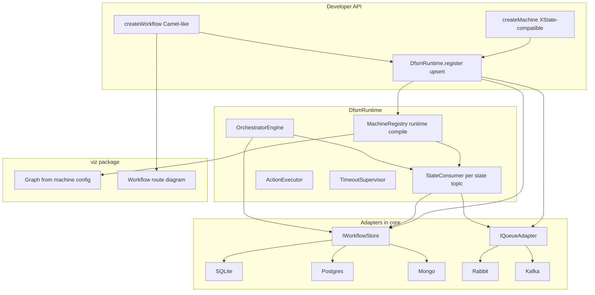
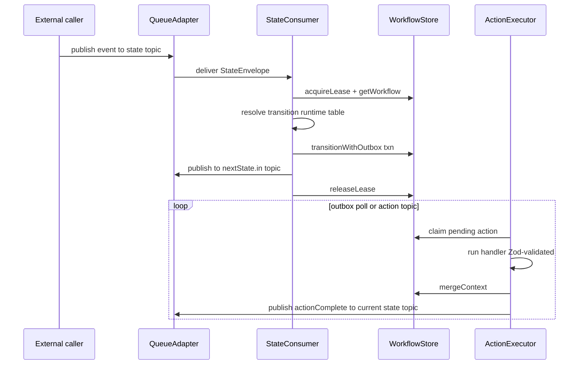

# DFSM v2 Rework Plan

## Goals vs today

| Today                                             | v2 target                                                                   |
| ------------------------------------------------- | --------------------------------------------------------------------------- |
| `dfsm compile` + `zod-to-ts` generated interfaces | Runtime Zod validation + TypeScript generics (no build step)                |
| `@eklabdev/dfsm-cli` (lint/compile/migrate/viz)   | Removed; `DfsmRuntime.registerMachine()` / `registerWorkflow()` upsert APIs |
| MongoDB-only `MongoStateStore`                    | `IWorkflowStore` with SQLite, PostgreSQL, MongoDB adapters in core          |
| In-process outbox polling                         | Queue-driven per-state consumers (RabbitMQ + Kafka adapters)                |
| `defineMachine` + Zod slots                       | XState-compatible config + DFSM `meta` for durable slots                    |
| Single-machine `WorkflowEngine`                   | `WorkflowOrchestrator` with subworkflows, entry/exit hooks                  |

---

## Target architecture



**Execution model (queue-driven):**



---

## Package changes

| Package                                                  | Action                                                                |
| -------------------------------------------------------- | --------------------------------------------------------------------- |
| [`packages/core`](packages/core)                         | Rewrite: adapters, runtime, orchestrator, remove compiler/`zod-to-ts` |
| [`packages/cli`](packages/cli)                           | **Delete** — upsert + viz become programmatic APIs                    |
| [`packages/viz`](packages/viz)                           | Keep; read live config from store instead of compiled artifacts       |
| [`examples/order-fulfilment`](examples/order-fulfilment) | Rewrite as canonical v2 demo                                          |
| [`examples/traffic-light`](examples/traffic-light)       | Simplify to SQLite + in-memory queue for local dev                    |

**New core dependencies (peer or bundled):** `better-sqlite3` or `sql.js`, `pg`, `mongodb`, `amqplib`, `kafkajs` (all in core per your preference).

**Remove:** `zod-to-ts`, CLI package, `.dfsm/` artifact dir, `generated/` interfaces.

---

## XState-compatible machine syntax

Align with [XState v5 config shape](https://stately.ai/docs/machines): `id`, `initial`, `context`, `states`, `on`, `after`, `entry`, `exit`, `type: 'final'`.

DFSM extends via **`meta.dfsm`** for serialisable durable contracts (Zod slots — no inline functions in persisted config):

```typescript
import { z } from "zod";
import { createMachine, createRuntime } from "@eklabdev/dfsm";

const orderMachine = createMachine({
  id: "order",
  initial: "pending",
  context: { orderId: "", customerId: "", amount: 0, sku: "" },
  types: {} as {
    context: OrderContext;
    events:
      | { type: "SUBMIT" }
      | { type: "PAYMENT_CAPTURED" }
      | { type: "CANCEL" };
  },
  states: {
    pending: {
      on: {
        SUBMIT: {
          target: "payment_processing",
          guard: "hasStock",
          actions: ["chargePayment"],
          meta: {
            dfsm: {
              guard: { hasStock: { input: z.object({ sku: z.string() }) } },
              actions: {
                chargePayment: {
                  input: z.object({
                    amount: z.number(),
                    customerId: z.string(),
                  }),
                  output: z.object({ chargeId: z.string() }),
                },
              },
            },
          },
        },
        CANCEL: { target: "cancelled", actions: ["recordCancellation"] },
      },
    },
    payment_processing: {
      after: { 300_000: "cancelled" },
      on: {
        PAYMENT_CAPTURED: { target: "fulfilling", actions: ["reserveStock"] },
        PAYMENT_FAILED: { target: "cancelled" },
      },
    },
    fulfilling: {
      /* ... */
    },
    shipped: {
      /* ... */
    },
    delivered: { type: "final" },
    cancelled: { type: "final" },
    refunded: { type: "final" },
  },
});
```

**Type safety without compile step:**

- `types: {} as { context, events }` gives event/context inference (same XState v5 pattern).
- `createRuntime<OrderActions, OrderGuards>()` maps handler `Map`s; inputs/outputs validated at runtime via Zod from `meta.dfsm`.
- Optional helper `inferHandlers(machine)` returns a typed handler contract object for IDE autocomplete (no code generation).

**Runtime compile** (replaces [`packages/core/src/compiler/compile.ts`](packages/core/src/compiler/compile.ts)):

- `lint()` — structural validation (keep existing rules + `type: 'final'` for terminals).
- `buildTransitionTable()` — same logic as today, runs on `registerMachine()`.
- `buildVizGraph()` — unchanged concept, reads XState-shaped config.
- `buildTopicBindings()` — new: one subscribe + one publish channel per state per version.

---

## Provider-agnostic logical schema

All adapters implement the same **logical tables/collections**. SQL adapters use normalized tables; Mongo uses embedded documents where practical.

### 1. `machine_definitions` (replaces `machine_registry`)

```typescript
interface MachineDefinitionRecord {
  id: string; // "{machineId}:{version}"
  machineId: string;
  version: number; // monotonic per machineId
  checksum: string; // sha256 of canonical config JSON
  config: MachineConfigJson; // serialisable XState-compatible config (meta.dfsm only)
  transitionTable: Record<string, Record<string, TransitionEntry>>;
  vizGraph: VizGraph;
  topicBindings: TopicBindings;
  slotSchemas: SlotSchemaRegistry; // flattened Zod JSON Schema for cross-provider storage
  status: "active" | "deprecated";
  migratedFrom: number | null;
  createdAt: string; // ISO-8601
  updatedAt: string;
}

interface TopicBindings {
  prefix: string; // e.g. "dfsm.order.v3"
  states: Record<
    string,
    {
      subscribe: string; // "dfsm.order.v3.pending.in"
      publish: string; // "dfsm.order.v3.pending.out"
      events: string[]; // allowed inbound event types for this state
    }
  >;
}
```

**Topic naming convention (portable across RabbitMQ exchanges and Kafka topics):**

```
dfsm.{machineId}.v{version}.{stateName}.in    // inbound events for workflows in this state
dfsm.{machineId}.v{version}.{stateName}.out   // transition results / action completions
dfsm.{machineId}.v{version}.__actions         // optional shared action dispatch topic
```

### 2. `workflow_instances` (replaces `workflow_state`)

```typescript
interface WorkflowInstanceRecord {
  id: string; // workflowId
  machineId: string;
  machineVersion: number; // pinned at start
  currentState: string;
  context: JsonObject;
  status: "active" | "completed" | "failed" | "suspended";
  version: number; // optimistic lock
  lockedUntil: string | null; // ISO-8601 lease expiry
  orchestrationId: string | null;
  orchestrationStepId: string | null;
  createdAt: string;
  updatedAt: string;
}
```

### 3. `workflow_history` (normalized for SQL; embedded array OK for Mongo)

```typescript
interface WorkflowHistoryRecord {
  id: string;
  workflowId: string;
  seq: number; // monotonic per workflow
  fromState: string;
  toState: string;
  event: string;
  eventPayload: JsonObject;
  contextSnapshot: JsonObject;
  dispatchedActions: string[];
  createdAt: string;
}
```

### 4. `pending_actions` (outbox — same semantics as today)

```typescript
interface PendingActionRecord {
  id: string;
  workflowId: string;
  actionName: string;
  idempotencyKey: string; // UNIQUE
  payload: JsonObject;
  status: "pending" | "executing" | "done" | "failed";
  attempts: number;
  lastError: string | null;
  createdAt: string;
}
```

### 5. `workflow_definitions` (orchestrator registry)

```typescript
interface WorkflowDefinitionRecord {
  id: string; // "{workflowId}:{version}"
  workflowId: string;
  version: number;
  checksum: string;
  definition: WorkflowDefinitionJson;
  vizGraph: WorkflowVizGraph;
  entryBindings: EndpointBinding[];
  exitBindings: EndpointBinding[];
  status: "active" | "deprecated";
  createdAt: string;
  updatedAt: string;
}

// Camel-like route definition
interface WorkflowDefinitionJson {
  id: string;
  initial: string; // first step id
  context: JsonObject;
  steps: Record<string, WorkflowStep>;
}

type WorkflowStep =
  | {
      type: "machine";
      machineId: string;
      inputMap: JsonPathExpr;
      outputMap: JsonPathExpr;
    }
  | {
      type: "subworkflow";
      workflowId: string;
      inputMap: JsonPathExpr;
      outputMap: JsonPathExpr;
    }
  | {
      type: "choice";
      branches: { when: string; target: string }[];
      otherwise?: string;
    }
  | { type: "parallel"; branches: string[]; join: string }
  | { type: "entry"; endpoint: EndpointBinding }
  | { type: "exit"; endpoint: EndpointBinding };

interface EndpointBinding {
  kind: "queue" | "http" | "timer";
  ref: string; // topic name or URL or cron
}
```

### 6. `orchestration_instances`

```typescript
interface OrchestrationInstanceRecord {
  id: string;
  workflowDefId: string;
  workflowDefVersion: number;
  currentStepId: string;
  context: JsonObject;
  status: "active" | "completed" | "failed" | "suspended";
  version: number;
  childRefs: ChildRef[]; // linked machine/subworkflow instance ids
  createdAt: string;
  updatedAt: string;
}

interface ChildRef {
  stepId: string;
  kind: "machine" | "subworkflow";
  instanceId: string;
  machineId?: string;
}
```

### 7. Queue envelope (generic, type-safe at edges)

```typescript
interface StateEnvelope<TPayload = unknown> {
  envelopeVersion: 1;
  messageId: string; // UUID, idempotency
  correlationId: string; // workflowId or orchestrationId
  machineId: string;
  machineVersion: number;
  state: string; // state this message targets
  event: { type: string; payload?: TPayload };
  context: JsonObject;
  metadata: {
    orchestrationId?: string;
    orchestrationStepId?: string;
    causationId?: string; // prior messageId
    timestamp: string;
  };
}
```

**SQL DDL sketch (Postgres/SQLite share shape):**

```sql
CREATE TABLE machine_definitions (
  id TEXT PRIMARY KEY,
  machine_id TEXT NOT NULL,
  version INTEGER NOT NULL,
  checksum TEXT NOT NULL,
  config JSON NOT NULL,
  transition_table JSON NOT NULL,
  viz_graph JSON NOT NULL,
  topic_bindings JSON NOT NULL,
  slot_schemas JSON NOT NULL,
  status TEXT NOT NULL,
  migrated_from INTEGER,
  created_at TIMESTAMPTZ NOT NULL,
  updated_at TIMESTAMPTZ NOT NULL,
  UNIQUE (machine_id, version)
);

CREATE TABLE workflow_instances (
  id TEXT PRIMARY KEY,
  machine_id TEXT NOT NULL,
  machine_version INTEGER NOT NULL,
  current_state TEXT NOT NULL,
  context JSON NOT NULL,
  status TEXT NOT NULL,
  version INTEGER NOT NULL DEFAULT 0,
  locked_until TIMESTAMPTZ,
  orchestration_id TEXT,
  orchestration_step_id TEXT,
  created_at TIMESTAMPTZ NOT NULL,
  updated_at TIMESTAMPTZ NOT NULL
);

CREATE TABLE workflow_history (
  id TEXT PRIMARY KEY,
  workflow_id TEXT NOT NULL REFERENCES workflow_instances(id),
  seq INTEGER NOT NULL,
  from_state TEXT, to_state TEXT, event TEXT,
  event_payload JSON, context_snapshot JSON,
  dispatched_actions JSON,
  created_at TIMESTAMPTZ NOT NULL,
  UNIQUE (workflow_id, seq)
);

CREATE TABLE pending_actions (
  id TEXT PRIMARY KEY,
  workflow_id TEXT NOT NULL,
  action_name TEXT NOT NULL,
  idempotency_key TEXT NOT NULL UNIQUE,
  payload JSON NOT NULL,
  status TEXT NOT NULL,
  attempts INTEGER NOT NULL DEFAULT 0,
  last_error TEXT,
  created_at TIMESTAMPTZ NOT NULL
);
-- + workflow_definitions, orchestration_instances with same logical fields
```

MongoDB: same field names, `workflow_history` can be embedded in `workflow_instances.history[]` for v1 Mongo adapter if desired, but **orchestration + SQL adapters require the normalized shape** — recommend normalized history everywhere for consistency.

---

## Adapter interfaces

```typescript
// packages/core/src/store/IWorkflowStore.ts
interface IWorkflowStore {
  setup(): Promise<void>;
  // Machine registry (upsert)
  upsertMachineDefinition(
    record: MachineDefinitionRecord,
  ): Promise<UpsertResult>;
  getActiveMachine(machineId: string): Promise<MachineDefinitionRecord | null>;
  getMachineVersion(
    machineId: string,
    version: number,
  ): Promise<MachineDefinitionRecord | null>;
  // Workflow instances
  createWorkflowInstance(params: CreateWorkflowParams): Promise<void>;
  getWorkflowInstance(id: string): Promise<WorkflowInstanceRecord | null>;
  acquireLease(id: string, ttlMs: number): Promise<boolean>;
  releaseLease(id: string): Promise<void>;
  transitionWithOutbox(params: TransitionParams): Promise<void>; // atomic txn per adapter
  mergeContext(id: string, partial: JsonObject): Promise<void>;
  // Outbox
  claimPendingActions(limit: number): Promise<PendingActionRecord[]>;
  markActionDone(id: string): Promise<void>;
  markActionFailed(id: string, error: string): Promise<void>;
  // Orchestration
  upsertWorkflowDefinition(
    record: WorkflowDefinitionRecord,
  ): Promise<UpsertResult>;
  createOrchestrationInstance(params: CreateOrchestrationParams): Promise<void>;
  getOrchestrationInstance(
    id: string,
  ): Promise<OrchestrationInstanceRecord | null>;
  advanceOrchestration(params: AdvanceOrchestrationParams): Promise<void>;
}

// packages/core/src/queue/IQueueAdapter.ts
interface IQueueAdapter {
  setup(bindings: TopicBindings[]): Promise<void>; // declare topics/exchanges; idempotent
  publish(topic: string, envelope: StateEnvelope): Promise<void>;
  subscribe(topic: string, handler: MessageHandler): Promise<Subscription>;
  unsubscribe(subscription: Subscription): Promise<void>;
}

interface UpsertResult {
  machineId: string;
  version: number;
  created: boolean; // false = checksum match, no-op
  topicsAdded: string[];
  topicsUnchanged: string[];
  // Never deletes topics or deprecates running consumer bindings
}
```

**Upsert semantics (requirement 6):**

- `registerMachine(machine)` computes checksum; if unchanged, return existing version (no new consumers).
- If changed: insert new version row, mark prior `active` → `deprecated`, call `queue.setup()` to **add** new topics only.
- `StateConsumer` manager subscribes to all `active` + `deprecated` versions that still have `active` workflow instances (lazy drain).
- In-flight workflows remain on pinned `machineVersion`; new `startWorkflow` uses latest active version.

---

## Workflow orchestrator usage example

```typescript
import { createWorkflow, createRuntime } from "@eklabdev/dfsm";

const orderFulfilment = createWorkflow({
  id: "order-fulfilment",
  initial: "receive-order",
  context: { orderId: "", customerId: "" },
  steps: {
    "receive-order": {
      type: "entry",
      endpoint: { kind: "queue", ref: "orders.created" },
      next: "process-payment",
    },
    "process-payment": {
      type: "machine",
      machineId: "order",
      inputMap: { orderId: "$.orderId", customerId: "$.customerId" },
      outputMap: { chargeId: "$.chargeId" },
      onComplete: "dispatch-shipping",
      onFailure: "compensate",
    },
    "dispatch-shipping": {
      type: "subworkflow",
      workflowId: "shipping",
      inputMap: { orderId: "$.orderId", chargeId: "$.chargeId" },
      onComplete: "notify-customer",
    },
    "notify-customer": {
      type: "exit",
      endpoint: { kind: "queue", ref: "orders.completed" },
    },
    compensate: {
      type: "machine",
      machineId: "order",
      inputMap: { orderId: "$.orderId" },
      // sends CANCEL / refund events via machine entry hook
    },
  },
});

const runtime = await createRuntime({
  store: { provider: "postgres", connectionString: process.env.DATABASE_URL },
  queue: { provider: "kafka", brokers: ["localhost:9092"] },
  actions: orderActions,
  guards: orderGuards,
});

await runtime.registerMachine(orderMachine); // upsert: DB + topics
await runtime.registerWorkflow(orderFulfilment); // upsert: DB + entry/exit bindings
await runtime.start(); // start consumers + supervisors

// External trigger
await runtime.ingest("orders.created", { orderId: "ord-1", customerId: "c-1" });
```

**Orchestration persistence:** `orchestration_instances` holds route position; each `machine` step spawns a `workflow_instances` row linked via `orchestrationId` + `orchestrationStepId`. Step completion is driven by machine reaching a `final` state or explicit `onComplete` event on the state `.out` topic.

---

## Viz updates ([`packages/viz`](packages/viz))

- **Machine diagram:** parse `machine_definitions.config` directly (XState-shaped) — no compiled artifact.
- **Workflow diagram:** new `WorkflowVizGraph` from `workflow_definitions` (steps as nodes, `next`/`onComplete`/`onFailure` as edges; `parallel`/`choice` as compound nodes).
- **Live overlay:** unchanged concept — poll `workflow_instances` grouped by `currentState`.
- **CLI removal:** expose `runtime.startVizServer({ port: 4242 })` or keep viz as importable package.

---

## Implementation phases

### Phase 1 — Core foundation (no queue yet)

- Delete [`packages/cli`](packages/cli), remove compiler/`zod-to-ts` from core.
- Introduce `createMachine()` with XState-compatible types + `meta.dfsm`.
- Runtime `registerMachine()` upsert → `IWorkflowStore` + in-memory transition table.
- Port Mongo adapter to new `IWorkflowStore` schema (normalized history).
- Add SQLite adapter (local dev default).
- Rewrite `order-fulfilment` example: no compile, direct `createRuntime`.

### Phase 2 — PostgreSQL + transactional parity

- Postgres adapter with real multi-statement transactions for `transitionWithOutbox`.
- Contract tests: same integration scenarios run against SQLite, Postgres, Mongo.

### Phase 3 — Queue layer

- `IQueueAdapter` + RabbitMQ + Kafka implementations.
- `TopicBindings` generation on register; `StateConsumer` per active binding.
- Replace direct `sendEvent()` hot path with queue publish (keep `sendEvent` as thin publish wrapper for DX).
- Upsert: additive topic creation, version-drain logic.

### Phase 4 — Workflow orchestrator

- `createWorkflow()`, orchestration store tables, `OrchestratorEngine`.
- Entry/exit hooks wired to queue adapters.
- Subworkflow linking + `childRefs` persistence.

### Phase 5 — Viz + docs

- Update viz for workflow routes + runtime config source.
- Replace architecture doc + ADRs; archive OpenSpec `dfsm` change, open new `dfsm-v2` change.
- Remove `traffic-light` compile path; add Kafka/Rabbit docker-compose profiles.

---

## Key design decisions (locked in)

- **XState-compatible syntax, no `@xstate/core` dependency** — full control over persistence hooks and queue bindings.
- **Monolithic `@eklabdev/dfsm`** — all store/queue adapters in core.
- **Normalized logical schema** — same JSON field names across SQLite/Postgres/Mongo; SQL uses JSON columns where appropriate.
- **Queue-per-state** — durable handoff between states; DB remains source of truth for instance position.
- **Upsert never tears down** — additive topics, version pinning, drain deprecated versions.

## Risks and mitigations

| Risk                                | Mitigation                                                                 |
| ----------------------------------- | -------------------------------------------------------------------------- |
| Kafka/Rabbit topic semantics differ | `TopicBindings` abstraction + adapter-specific `setup()` mapping           |
| SQL txn parity for outbox           | Adapter-level `withTransaction()` callback; integration tests per provider |
| Type safety without codegen         | `types` generic + runtime Zod + `inferHandlers()` helper                   |
| Orchestrator complexity             | Phase 4 after queue+store proven; start with linear + subworkflow only     |

## Success criteria for v2 MVP (end of Phase 3)

- Order-fulfilment example runs with **no compile step** and **no CLI**.
- Same workflow completes on SQLite (dev), Postgres (CI), Mongo (existing users).
- State transitions flow through RabbitMQ or Kafka with DB persistence.
- `registerMachine()` upsert is idempotent; updating machine adds v2 topics without breaking v1 in-flight instances.
- Viz renders machine from stored config.
