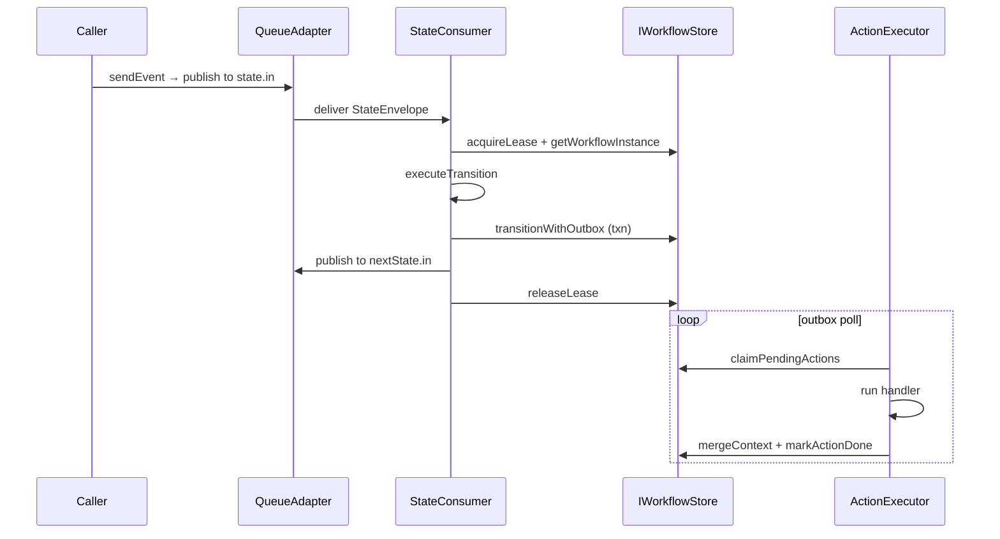

# @eklabdev/dfsm architecture (v2)

This document describes how **@eklabdev/dfsm** combines XState-compatible machine definitions, provider-agnostic persistence, and queue-driven state execution.

## Developer API

- **`createMachine()`** — XState-compatible config with `meta.dfsm` Zod slots for durable contracts
- **`createWorkflow()`** — Camel-like route definitions with machine/subworkflow/choice/parallel steps
- **`createRuntime()`** — wires store, queue, actions, guards; `registerMachine()` / `registerWorkflow()` upsert APIs
- **No compile step, no CLI** — runtime validates, builds transition tables, and persists definitions on register

## Contract separation: config vs implementation

The **machine definition** is serialisable configuration: states, transitions, and **slots** (named action and guard hooks) described only with **Zod schemas** in `meta.dfsm`. No handler functions are stored in the database.

**Implementations** live in application code: `Map`s of handlers keyed by slot name, wired when `createRuntime()` is called. Runtime Zod validation uses schemas from `meta.dfsm`.

## Provider-agnostic logical schema

All store adapters (SQLite, PostgreSQL, MongoDB) implement the same logical tables:

| Table | Purpose |
|-------|---------|
| `machine_definitions` | Registered machines with transition table, viz graph, topic bindings |
| `workflow_instances` | Live workflow position, context, optimistic lock, lease |
| `workflow_history` | Normalized append-only transition audit log |
| `pending_actions` | Outbox for durable action dispatch |
| `workflow_definitions` | Orchestrator route definitions |
| `orchestration_instances` | Multi-step workflow position and child refs |

## Queue-driven execution

Each state has inbound/outbound topics (`dfsm.{machineId}.v{version}.{state}.in|out`). External callers use `sendEvent()` which publishes to the current state's inbound topic. A **StateConsumer** per binding:

1. Acquires lease + loads workflow
2. Resolves transition from runtime transition table
3. **`transitionWithOutbox`** — atomic state update + history + outbox inserts
4. Publishes to next state's topic

**ActionExecutor** polls `pending_actions`, runs handlers, merges context results.

## Upsert semantics

`registerMachine()` computes a checksum of canonical config JSON:

- **Unchanged checksum** → no-op, existing version retained
- **Changed** → new version row, prior marked `deprecated`, **additive** topic creation only
- In-flight workflows stay pinned to their `machineVersion`; consumers drain deprecated versions while active instances exist

## Orchestrator

`createWorkflow()` defines multi-step routes. **OrchestratorEngine** handles:

- **Entry** steps bound to queue topics (`runtime.ingest()`)
- **Machine** steps spawn `workflow_instances` linked via `orchestrationId`
- **Subworkflow** steps create child orchestration instances with `childRefs`
- **Exit** steps publish to outbound topics

## Viz

`runtime.startVizServer({ port })` or `@eklabdev/dfsm-viz` reads live config from `machine_definitions` / `workflow_definitions` — no compiled artifacts.

## Transition lifecycle

