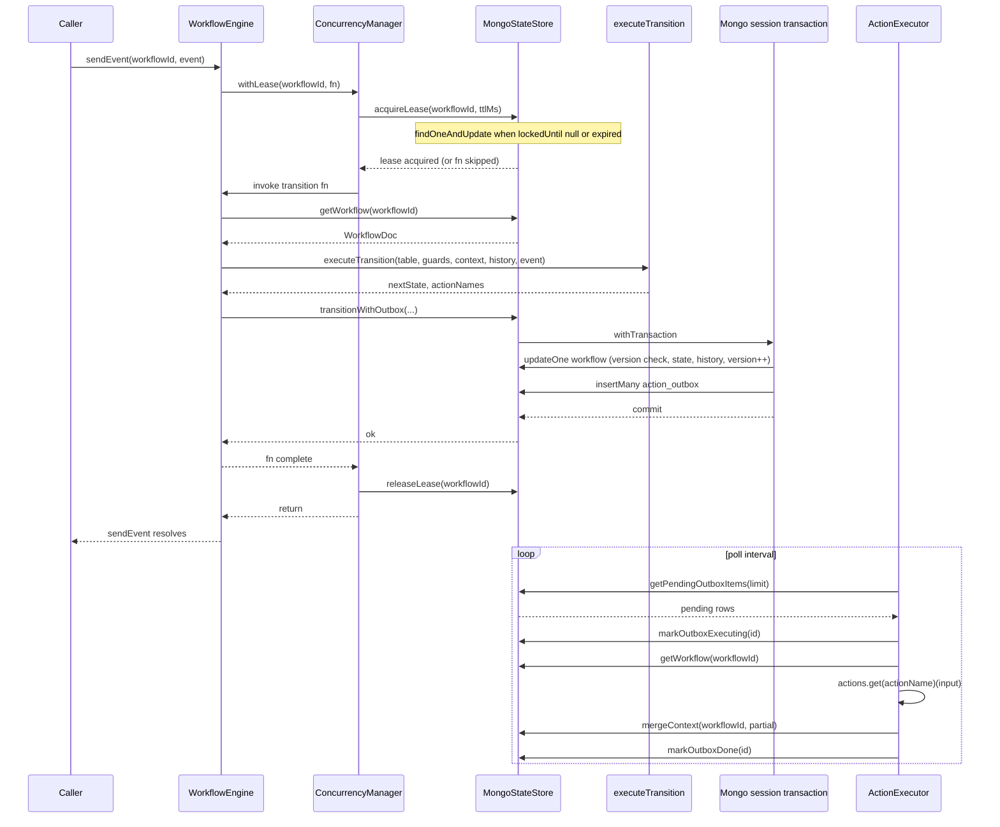

# @eklabdev/dfsm architecture

This document describes how **@eklabdev/dfsm** (`dfsm`) combines declarative finite-state machines, MongoDB durability, and compile-time contracts. It reflects the design implemented in `packages/core`, `packages/cli`, and related packages.

## Contract separation: config vs implementation

The **machine definition** is serialisable configuration: states, transitions, and **slots** (named action and guard hooks) described only with **Zod schemas** for inputs and outputs. No guard or action **functions** are stored in MongoDB or embedded in the persisted transition table.

**Implementations** live in application code: a `Map` of handlers keyed by slot name, wired when the `WorkflowEngine` is constructed. The **compile** step (`dfsm compile`) reads the machine config and emits TypeScript interfaces (`generated/I*Actions.ts`, `I*Guards.ts`) so implementations **satisfy** the same contracts the machine declared—without duplicating schema definitions by hand.

In short: the machine **declares** contracts (Zod-only slots); the developer **fulfils** them (typed handlers).

## DB-native state: the document is the machine instance

Authoritative runtime state for a workflow lives in a single **`workflow_state`** document keyed by `workflowId` (`_id`). That row holds:

- **Current FSM position**: `currentState`, `machineId`, **`machineVersion`** (pinned when the workflow started).
- **Accumulated data**: `context` (BSON document, shallow-merged on updates).
- **Concurrency**: `version` (optimistic lock counter), `lockedUntil` (lease expiry).
- **Lifecycle**: `status`, timestamps.

There is no separate “projection” or snapshot store that must be reconciled with the database: for a given workflow, **the row is the live machine**. The **compiled transition table** used at runtime is selected by `machineId` + **`machineVersion`** on that document (with in-memory maps today; loading historical versions from `machine_registry` is the intended extension for long-lived version pins).

## Outbox pattern: `transitionWithOutbox`

A transition may **dispatch** one or more **action slots** (ordered names only). Side effects must not run inside the same critical section as the state transition without risking inconsistency if the process crashes after updating state but before effects complete.

**`transitionWithOutbox`** runs inside a **MongoDB multi-document transaction** (`session.withTransaction`):

1. **Update** `workflow_state`: next state, `$inc` `version`, **`$push`** a `history` entry, optional `context` field sets, terminal `status` when applicable—only if `version === expectedVersion` (else `ConcurrentModificationError`).
2. **Insert** rows into **`action_outbox`** for each dispatched slot, each with a **unique `idempotencyKey`** (backed by a unique index).

That single transaction solves the **dual-write** problem between “state moved” and “work was scheduled”: either both commit or neither does.

A background **`ActionExecutor`** polls pending outbox items, marks them executing, loads the workflow, invokes the registered handler, **`mergeContext`** for partial results, then marks the item done (with retries and max-attempt handling on failure). **`mergeContext`** runs **after** the transition lease is released, so handlers should be **idempotent** and tolerate brief interleaving with the next **`sendEvent`** on the same workflow.

## Context accumulator and append-only history

**`context`** is a long-lived key/value bag: fields **survive across states** unless explicitly overwritten by guarded updates or action results (`mergeContext` after outbox execution). It is the working memory of the workflow.

**`history`** is an **append-only** array of structured entries (from/to state, event, payload, **context snapshot at transition time**, dispatched action names). It is an **audit log** and debugging aid, not a second source of truth for current position—that remains `currentState` + `context`.

## MongoDB concurrency: leases and optimistic locking

Two layers cooperate:

1. **Lease (`lockedUntil`)** — Before handling an event, **`ConcurrencyManager.withLease`** calls **`acquireLease`**: a **`findOneAndUpdate`** that matches the workflow only when `lockedUntil` is null or **past** (`$lt: now`), and sets `lockedUntil` to `now + ttl`. That is the analogue of **“SELECT … FOR UPDATE”** in the sense of **claiming the row** for exclusive processing for a bounded time. **`releaseLease`** clears the lease in `finally`.

2. **Optimistic concurrency (`version`)** — **`transitionWithOutbox`** updates only when `version` matches **`expectedVersion`**. Concurrent writers that read stale versions get **no match** and the store throws **`ConcurrentModificationError`**.

Together, leases reduce concurrent `sendEvent` overlap; version checks catch races that still slip through.

## Migration model: versions, in-flight isolation, compile gate

- **`machine_registry`** stores each **compiled** machine revision (`machineId`, monotonic **`version`**, serialised transition table, viz graph, slot **names** only). **`saveMachineVersion`** deprecates prior `active` rows and inserts the new active version.
- **New workflows** bind **`machineVersion`** from **`getActiveMachine`** at **`startWorkflow`** time.
- **In-flight workflows** keep their original **`machineVersion`** and therefore the **transition table semantics** they started under, isolating them from a newly migrated definition until they complete (by design).
- **`dfsm migrate up`** requires a prior **`dfsm compile`** (artifact + generated interfaces on disk), then runs **`npx tsc --noEmit`** from the project **`cwd`**. If TypeScript fails, **no DB write** occurs—implementations must align with generated contracts before a version is published to the registry.
- **`dfsm migrate down`** (current CLI behaviour) refuses to proceed when **active** workflows still exist for a machine, enforcing **drain** before rollback discussions.

## Transition lifecycle (sequence)

End-to-end flow from an external **`sendEvent`** through transactional persistence to outbox relay:

The diagram shows **lease → read → pure transition → transactional state + outbox** on the hot path, and **asynchronous outbox consumption** updating context after effects complete.
